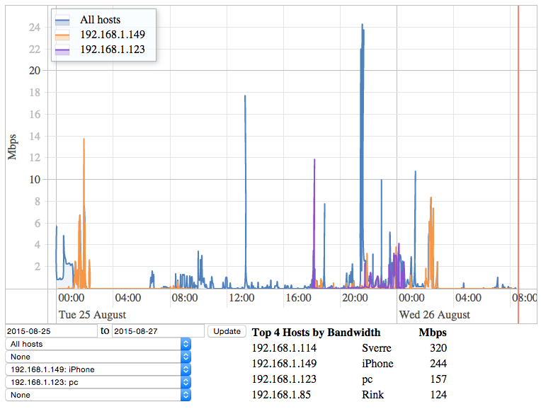

# Bandwidth Monitor
Started as a learning experiment and wanting to know what has been consuming the bandwidth in the household, and at what time.

## Environment
Running on a linux host, that has an interface connected to a shark-tap.  Running the scripts in tmux for now.

  - bin/capture.bash - Running tcpdump on the sniffing interface
  - bin/process_pcaps.bash - Script to loop
  - bin/web_serv.py - Run native flask web server on port 8123

## Requirements

General:
  - python3 (may work on 2.7+, but has not been tested)
  - sqlite3
  - tcpdump

Python Modules:
  - flask - http://flask.pocoo.org/
  - pypacker - https://github.com/mike01/pypacker

Javascript Additions:
  - Vis.js - http://visjs.org/ - place in html/js/vis
  - JQuery - http://jquery.com/ - place in html/js/jq
  - JQueryUI - http://jqueryui.com/ - place in html/js/jqui

## To do:
  - paramaterize utilities
  - configurize with configuration file
  - daemonize scripts
  - remove tcpdump requirement with python sniffing
  - post load process to aggregate data to longer term tables
    - average from minute to hour, day
    - allow pull from lower resolution tables for performance
  - add archival of data in tables (table maintenance)
  - add removal of archives
